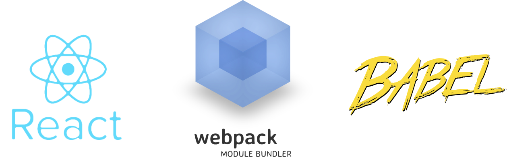

<h2 align="center">

  
  <br/>
  Configurando o webpack e Babel
</h2>

---

## O que é o Babel?

Babel é um compilador JavaScript. Ele converte código escrito em sintaxes mais recentes do JavaScript (ECMAScript 2015+), que podem ser incompatíveis com diferentes browsers, para uma sintaxe compatível. Entre no site do projeto para mais detalhes (Babel).

## O que é o webpack?

O webpack é um empacotador de módulos estáticos para aplicações JavaScript modernas. Ao processar a aplicação o webpack gera um gráfico que mapeia cada módulo e suas dependências e gera um ou mais pacotes.

### Iniciando um pequeno projeto

#### 1) Instalando as dependências

Crie o diretório do projeto:

`mkdir react-app && cd react-app`

Para iniciar o pequeno projeto, crie o arquivo “package.json” para automação de seus scripts e organização de seu projeto com o comando:

`npm init -y`

Em seguida, instale as dependências, isto é, pacotes e bibliotecas sobre os quais o projeto será construído. Iremos instalar as dependências que se seguem:

`npm i -D @babel/core @babel/preset-env @babel/preset-react babel-loader`

`npm i -D react react-dom`

`npm i -D html-loader html-webpack-plugin webpack webpack-cli webpack-dev-server`

Resumidamente, o que estes pacotes significam para seu projeto é:

**“@babel/core”** = Núcleo do compilador Babel.

**“@babel/preset-env”** =Torna o código mais recente (ECMAScript 2015+) compatível.

**“@babel/preset-react”** = Converte JSX em JavaScript compatível.

**“babel-loader”** = Plugin do webpack que “transpila” o código.

**“react”** = Pacote genérico do React.

**“react-dom”** = Pacote que tem a função de intermediar o que será renderizado (componentes) e o DOM.

**“html-loader”** = Exporta HTML como string.

**“html-webpack-plugin”** = Plugin que simplifica a criação do HTML para servir os arquivos unificados gerados pelos loaders.

**“webpack”** = Pacote genérico do webpack.

**“webpack-cli”** = Linha de comando do webpack (será utilizado para iniciar seu projeto).

**“webpack-dev-server”** = Ele atualiza automaticamente sua aplicação após mudanças nos arquivos. Em outras palavras, ele é um facilitador de vidas :)

#### 2) Configurando o arquivo “.babel.config.js”

Após a instalação das dependências, crie na raiz de seu projeto o arquivo **‘.babel.config.js’**. Este é o arquivo de configuração do babel. Configure-o da seguinte forma:

```
module.exports = {
  presets: ["@babel/preset-env", "@babel/preset-react"],
};
```

#### 3) Configurando o arquivo “webpack.config.js”

Você deve configurar o webpack também! Para isso, crie na raiz de seu projeto o arquivo de configuração **“webpack.config.js”**. Lembra que, lá em cima, eu disse que o webpack precisa de um arquivo de entrada (entry point) e um arquivo de saída (output)? Esses detalhes são configurados no **“webpack.config.js”**, assim como os loaders (babel-loader e html-loader) e os plugins necessários (‘html-webpack-plugin’).

Apenas um pequeno detalhe. A partir da versão 4 do webpack, você não precisa configurar o entry point e nem o local de saída dos seus arquivos. Nesta versão, por default, o webpack busca uma pasta nomeda **“src”** na raiz do seu projeto. Em seguida, dentro da pasta **“src”**, ele busca o arquivo de entrada nomeado **“index.js”**. Após encontrar o **“index.js”**, o webpack cria uma pasta na raiz chamada **“dist”**, onde estarão seus arquivos de saída. É tudo automático, mas você pode mudar essas configurações padrões, se você desejar. Neste post, vamos utilizar os caminhos de diretório padrões.
Dito isso, antes de começar a configurar o **“webpack.config.js”**, crie a pasta **“src”** na raiz do projeto e, dentro dele, crie o arquivo **“index.js”**.

`mkdir src && touch src/index.js`

Agora, crie o arquivo **“webpack.config.js”** também na raiz de seu projeto e o configure da seguinte forma:

```
const path = require("path");

module.exports = {
  entry: path.resolve(__dirname, "src", "index.js"),
  output: {
    path: path.resolve(__dirname, "public"),
    filename: "bundle.js",
  },
  module: {
    rules: [
      {
        test: /\.js$/,
        exclude: /node_modules/,
        use: {
          loader: "babel-loader",
        },
      },
    ],
  },
};
```

Para executar o webpack, ultilize o seguinte comando:

```
npx webpack --mode development
```

Exelente, para finalizar precisamos só instalar uma ferramenta para monitorar as mudanças no código, para isso vamos instalar o **'webpack-dev-server'**

`npm install webpack-dev-server --save-dev`

Agora vamos adicionar mais um comando no nosso arquivo de configuração do webpack **“webpack.config.js”**:

```
devServer: {
    contentBase: path.resolve(__dirname, "public"),
},
```

O arquivo de configuração final do webpack deverá ficar assim:

```
const path = require("path");

module.exports = {
  entry: path.resolve(__dirname, "src", "index.js"),
  output: {
    path: path.resolve(__dirname, "public"),
    filename: "bundle.js",
  },
  devServer: {
    contentBase: path.resolve(__dirname, "public"),
  },
  module: {
    rules: [
      {
        test: /\.js$/,
        exclude: /node_modules/,
        use: {
          loader: "babel-loader",
        },
      },
    ],
  },
};
```

Para executar o webpack com o reload ultilize o seguinte comando:

```
npx webpack-dev-server --mode development
```
